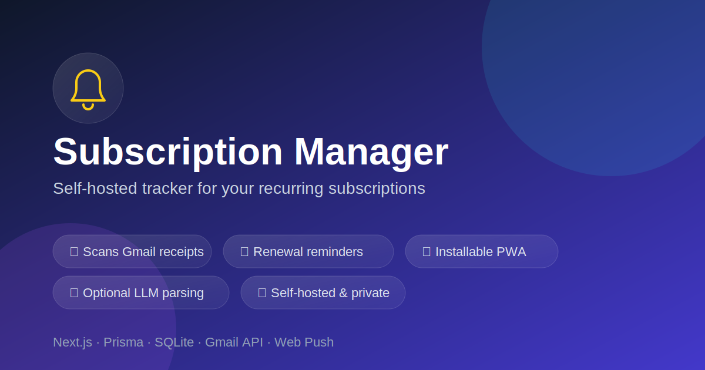

<p align="center">
  
</p>

# Subscription Manager

A self-hosted web app that scans your connected Gmail accounts for
subscription/billing emails, tracks renewal dates and amounts, and sends
renewal reminders via push notification and email. Installable as a PWA on
iPhone/Android.

Your data stays in your own SQLite database — nothing is sent anywhere
except the optional OpenRouter call for LLM-assisted parsing.

## Features

- **Multi-account Gmail sync** — connect any number of Gmail accounts via OAuth
- **Automatic detection** of subscription/receipt emails with service name,
  amount, currency, billing cycle, and next renewal date
- **Rule-based parsing** by default, with an optional **LLM-assisted mode**
  (via [OpenRouter](https://openrouter.ai)) for harder-to-parse emails
- **Renewal reminders** via Web Push and/or email, with configurable lead time
- **Dashboard** showing upcoming renewals and total monthly/yearly spend
- **PWA** — installable on iPhone/Android home screen, works offline-ish

## Setup

### 1. Google OAuth credentials (for Gmail access)

1. Create/select a project in the [Google Cloud Console](https://console.cloud.google.com/).
2. Enable the **Gmail API** (APIs & Services → Library).
3. Go to **APIs & Services → Credentials → Create Credentials → OAuth client ID**.
   - Application type: **Web application**
   - Authorized redirect URI: `http://localhost:3000/api/accounts/callback`
     (update if you change `APP_BASE_URL`)
4. Copy the generated **Client ID** and **Client Secret**.
5. On the **OAuth consent screen / Audience** page, add the Gmail scopes used
   by this app (`gmail.readonly`, `gmail.send`, `userinfo.email`) and add your
   Google account(s) as test users while the app is unpublished.

### 2. Environment variables

```bash
cp .env.example .env
```

Fill in:

- `GOOGLE_CLIENT_ID` / `GOOGLE_CLIENT_SECRET` — from step 1
- `TOKEN_ENCRYPTION_KEY` — any long random string, e.g. `openssl rand -hex 32`
- `VAPID_PUBLIC_KEY` / `VAPID_PRIVATE_KEY` — run `npx web-push generate-vapid-keys`
- `OPENROUTER_API_KEY` — optional, enables LLM-assisted email parsing via
  [OpenRouter](https://openrouter.ai/keys) (Hybrid/LLM modes fall back to
  rule-based parsing if this is unset)

See `.env.example` for the full list of variables, including optional cron
schedules and a `CRON_SECRET` to protect the manual sync endpoint.

### 3. Install & run

```bash
npm install
npx prisma migrate dev
npm run dev
```

Open [http://localhost:3000](http://localhost:3000).

## Usage

1. **Accounts** — connect one or more Gmail accounts via OAuth.
2. Click **Sync now** (or **Sync all accounts** on the dashboard) to scan for
   subscription emails and populate **Subscriptions**.
3. **Settings** — choose how emails are parsed (rule-based, hybrid, or LLM),
   configure renewal reminder timing/channels, and enable push notifications
   on this device.
4. **Subscriptions** — review, edit, add manually, or cancel/delete entries.

### Installing on iPhone (PWA)

In Safari, open the app, tap **Share → Add to Home Screen**. Open it from the
home screen icon, then go to **Settings** and tap **Enable push
notifications on this device** (requires iOS 16.4+).

### Background sync & reminders

A scheduler runs inside the Next.js server (`src/instrumentation.ts`) that
periodically syncs all accounts and checks for due reminders. Schedules are
configurable via `SYNC_CRON_SCHEDULE` and `REMINDER_CRON_SCHEDULE` (cron
syntax). You can also trigger both manually:

```bash
curl -X POST http://localhost:3000/api/cron
```

## Tech stack

[Next.js](https://nextjs.org) (App Router, TypeScript) ·
[Prisma](https://www.prisma.io) + SQLite ·
[googleapis](https://github.com/googleapis/google-api-nodejs-client) (Gmail API) ·
[web-push](https://github.com/web-push-libs/web-push) ·
[OpenRouter](https://openrouter.ai) (optional LLM parsing)

## License

[MIT](LICENSE)
